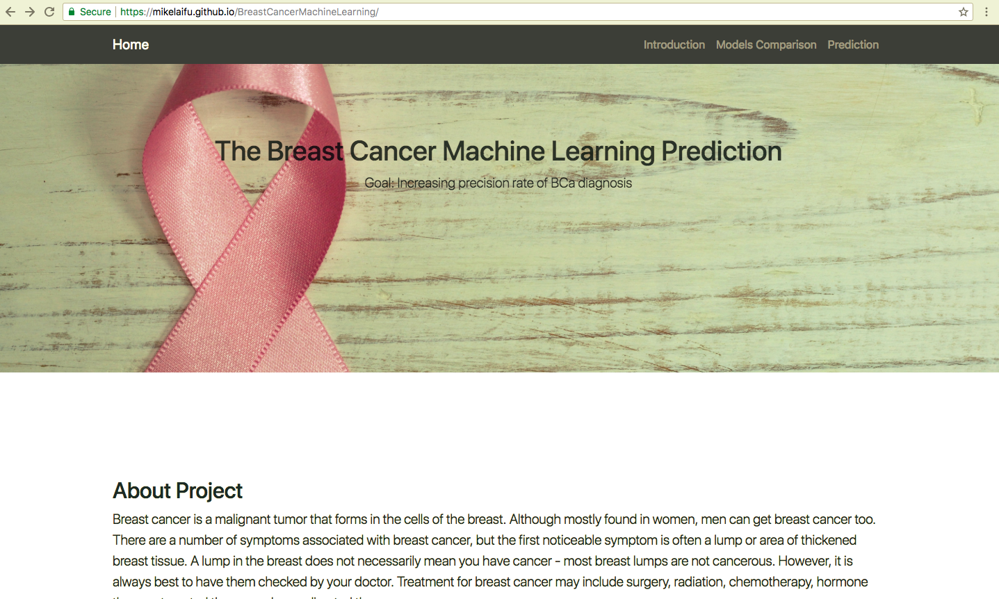

# Breast Cancer Machine Learning Prediction Project

 Breast cancer is a malignant tumor that forms in the cells of the breast. Although mostly found in women, men can get breast cancer too. 
There are a number of symptoms associated with breast cancer, but the first noticeable symptom is often a lump or area of thickened breast tissue. 
A lump in the breast does not necessarily mean you have cancer - most breast lumps are not cancerous. However, it is always best to have them checked
by your doctor. Treatment for breast cancer may include surgery, radiation, chemotherapy, hormone therapy, targeted therapy or bone-directed therapy.

To increase the accuracy of breast cancer diagnosis, 6 different machine learning techniques are applied with different input patient features. The selected supervised machine learning techniques have been widely applied in cancer research for the development of predictive model. Every model is explored individually by parameter adjustment, feature selection and method optimization to maximize its ability. The comparison figure will show the summary of results from each model and which one is the best! In addition to finding the best model, features exploration methods ( decision tree, Random forest, Principal component analysis (PCA) ) were performed to visualize how each features could contribute the results of our predoctions.

In the predictions, confidence of each predcited results are visaulized along with the confusion matrix of results.

Digital Lab applied 6 machine learning models to predict breast cancer and here are our brief introductions and logic we followed to achieved these results:

* Models: Support Vector Machine (SVM), Decision Tree (C4.5), Naive Bayes (NB) and k Nearest Neighbors (k-NN), random forest, neural network
* Team: Irene, Cong, Boren, Mike
* Technology: Python Keras, scikit-learn, Pandas, Matplotlib | Javascript, HTML, CSS, Bootstrap

### Preview:

